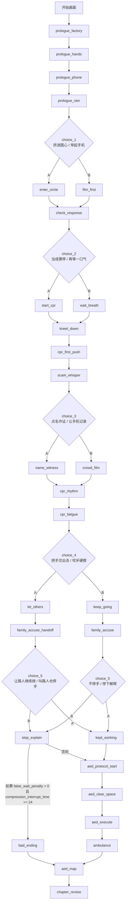

# 《生命守护者》第一章剧情总表

> 本文件是第一章唯一的剧情主文档。剧情节点、分支汇合、坏结局条件与章节承接，统一以 `demo/js/scenes.js` 为准。

## 一、梳理结论

我先按运行时代码把所有分支重新核对了一遍，结论是：

1. 主线闭环成立，没有出现“某条支线突然跳到毫无铺垫节点”的硬伤。
2. 真正需要修的是旧文档与运行时代码的描述不一致，不是剧情骨架本身。
3. 这次整理后，所有正式节点名、分支图、坏结局条件、AED 流程顺序都统一按代码重写。

### 已确认并修正的旧偏差

- **坏结局条件**：旧文档写成 `choice_1:B -> choice_2:B -> choice_5:B`，但代码实际条件是 `false_wait_penalty > 0 && compression_interrupt_time >= 24`，也就是 **`choice_2:B + choice_5:B` 就足够触发**。现在以代码为准；`choice_1:B` 只是风险放大项，不是硬前置。
- **家属冲突阶段**：运行时有两个版本：`family_accuse` 与 `family_accuse_handoff`。旧文档常把它们写成一个点，这次拆清楚。
- **`crowd_film` 分支承接不足**：旧故事文档里，录像线对“谁打 120、谁去拿 AED”的铺垫不够。现在按代码补齐：林小雨拨 120，马志国进站取 AED。
- **`stop_explain` 承接不足**：这条线不是“停下解释就直接切到 AED”，而是“中断 24 秒后重新恢复按压，再进入 AED 流程”。
- **AED 段编号不统一**：统一改成“第一章·第六阶段（AED流程）”，不再写成“第六章”。

## 二、统一命名规则

### 1. 唯一正式节点名

正式节点一律采用运行时 `scene id`：

- `prologue_factory`
- `prologue_hands`
- `prologue_phone`
- `prologue_rain`
- `choice_1`
- `enter_circle`
- `film_first`
- `check_response`
- `start_cpr`
- `wait_breath`
- `cpr_first_push`
- `scam_whisper`
- `name_witness`
- `crowd_film`
- `cpr_rhythm`
- `cpr_fatigue`
- `let_others`
- `keep_going`
- `family_accuse`
- `family_accuse_handoff`
- `kept_working`
- `stop_explain`
- `bad_ending`
- `aed_protocol_start`
- `aed_clear_space`
- `aed_execute`
- `ambulance`
- `aed_map`
- `chapter_review`

### 2. 旧名称如何理解

- `task_split`：旧素材文档里的汇合概念，现统一归入 `cpr_rhythm -> cpr_fatigue` 这一段。
- `aed_arrival`：旧文档对 AED 到场到正式执行前这段的统称，现统一拆成 `aed_protocol_start -> aed_clear_space -> aed_execute`。
- 大量 `ch1_*`：旧素材索引编号，不再作为正式剧情节点，只作为旧稿别名。

## 三、全章分支图

## 四、为什么这些分支汇合不突兀

### Choice 1 汇合到 `check_response`

- `enter_circle` 和 `film_first` 的区别是 **延误时长、王远的心理姿态、公众传播风险**。
- 两条路最终都会走到老人身边做判断，因此汇合合理。
- 这不是“无差别汇合”，而是 **同一行为目标下的不同前置代价**。

### Choice 2 汇合到 `cpr_first_push`

- `start_cpr` 与 `wait_breath` 的核心差异是 **有没有错过那 22 秒**。
- 一旦决定按骤停处理，第一下按压就必须发生，所以两路在 `cpr_first_push` 汇合是医学逻辑上的必然。

### Choice 3 汇合到 `cpr_rhythm`

- `name_witness` 与 `crowd_film` 都不再改变“第一下是否发生”，只改变 **现场秩序、证人可信度、AED 调度速度、传播压力**。
- 汇合前铺垫现在已补齐：
  - A 路：人群被点名，转成协作链。
  - B 路：林小雨拨 120，马志国去取 AED，但现场更容易滑向公开围观。

### Choice 4 后不直接汇合，而是进入家属冲突的两个版本

- `let_others` 和 `keep_going` 都会把戏剧推进到赵雪梅冲入现场，但站位不同：
  - `family_accuse_handoff`：年轻路人已接手按压，王远在旁边稳节奏。
  - `family_accuse`：王远本人还在按压。
- 这不是突兀，而是同一冲突在不同物理布局下的两个表演版本。

### Choice 5 汇合到 AED 流程

- `kept_working`：按压连续，信任链更完整。
- `stop_explain`：出现 24 秒中断，但剧情明确写出“重新恢复按压”，所以后续还能进入 AED 流程。
- 真正的分流不是“能不能见到 AED”，而是 **是否触发坏结局评价与更重的心理负担**。

## 五、隐藏变量与第二章承接

| 变量 | 来源 | 主要影响 |
| --- | --- | --- |
| `press_start_delay` | `choice_1` | 第一按压延误、医学复盘 |
| `false_wait_penalty` | `choice_2:B` | 坏结局判定、心理负担 |
| `resource_activation` | `choice_3` | 证人线 / 录像线 |
| `compression_interrupt_time` | `choice_5:B` 等 | 医学复盘、坏结局判定 |
| `compression_quality` | `cpr_rhythm`、`choice_4` | 医学评分 |
| `takeover_success` | `let_others` 交接结果 | 协作评分 |
| `aed_arrival_timing` | `choice_3` | AED 到场节奏 |
| `aed_protocol_clean` | AED 交互 | 专业性评分 |
| `witness_credibility` | 证人是否被激活 | 第二章舆论可信度 |
| `public_spread` | 录像 / 直播分支 | 第二章传播压力 |
| `family_trust` | 家属冲突阶段 | 家属态度与和解可能 |
| `wangyuan_burden` | 延误、中断、硬撑 | 王远心理线 |

### 第二章承接方向

- **舆论压力**：`public_spread`、`witness_credibility`
- **医护/警方时间线认可度**：`witness_credibility`、`aed_protocol_clean`
- **赵雪梅后续态度**：`family_trust`、`compression_interrupt_time`
- **王远心理余波**：`wangyuan_burden`
- **社区培训与 AED 系统议题**：`aed_arrival_timing` 与章节复盘结果

## 六、完整剧情正文

## 第一部分：序幕

### `prologue_factory`｜抹不掉的浓烟

三年前的服装厂火灾，是王远心里的原始创口。他不是没看见危险，而是在“别进去”的劝阻下退了一步。这个序幕不是为了卖惨，而是解释他为什么会在第一章对“伸手”和“退缩”格外敏感。

### `prologue_hands`｜雨夜的油门

现在的王远只是一个被生活磨过的外卖骑手。他不是天生英雄，但“路过医院总会多看一眼急诊灯”的习惯，说明那场火留下的钉子一直还在。

### `prologue_phone`｜剧本的选择

手机的一边是超时扣款，另一边是只看过 17 秒的 CPR 与 AED 推送。这个节点把整章冲突一次性摆清：**生计压力、旁观风险、零碎急救知识** 同时压在王远身上。

### `prologue_rain`｜雨夜的圆圈

暴雨夜的老城区地铁口，人群围成不规则圆圈。老人倒在雨棚内侧、湿滑防滑地砖上，不在露天暴雨和深积水里。这里先埋下三条后续协作者线：

- 林小雨已经看出不对，但不敢先动。
- 马志国身体先“答应”了，却还没真正走进圆心。
- 围观者已经构成社会性压力场。

## 第二部分：第一章主线

### `choice_1`｜第一反应

王远的第一个抉择，不是“会不会救”，而是“先冲进去，还是先给自己留证据”。

#### A 路：`enter_circle`｜拨开人群

王远直接挤进圆心，膝盖先着地。这条路的重点不是热血，而是他第一次用身体动作压过了三年前的退缩记忆。这里也顺带说明：现场具备就地急救条件，没有车流、深水或裸露电线逼迫他移动患者。

#### B 路：`film_first`｜先固定现场证据

王远先举起手机，不是为了作秀，而是为了让自己“退不回去”。这条路更能体现普通人在现实风险里的本能自保，也把 `public_spread` 的风险提前埋下。

### `check_response`｜死神的叹息

无论哪条路，王远都会跪到老人肩侧，判断反应和呼吸。他没有去摸脉搏，只看胸廓和鼻口。老人出现的是濒死叹息，不是正常呼吸。林小雨其实已经判断对了，但那句“应该按压”还只是含在喉咙里的半句话。

### `choice_2`｜当成骤停，还是再等等

#### A 路：`start_cpr`｜果断行动

王远想起那 17 秒里最关键的一句：没有正常呼吸，或只有濒死叹息，就按心脏骤停处理。他快速找到胸骨下半部位置，决定开始按压。

#### B 路：`wait_breath`｜错失的 22 秒

王远被“万一判断错了怎么办”卡住，等了 22 秒。老人嘴唇的乌紫色进一步扩散，这 22 秒成为后面坏结局条件的一部分，也让王远的心理负担提前加重。

### `cpr_first_push`｜第一下

不管前面迟没迟，这一刻第一下按压终于发生。它既是动作节点，也是叙事节点：从这里开始，王远已经不再处于“围观”位置，而被彻底卷进救治链。

### `scam_whisper`｜冰冷的窃窃私语

真正压上来的不只是雨，还有“别碰、会说不清、会倾家荡产”的耳语。这个节点把现实中的社会恐惧具象化：医学判断之后，紧接着是社会风险判断。

### `choice_3`｜如何调动现场资源

#### A 路：`name_witness`｜打破冷漠的箭

王远开始对具体的人说话，而不是对“大家”说话：

- 孙建国：打 120，开免提
- 马志国：进站取 AED
- 林小雨：计时、作证

这条路的核心收益是把围观者拉成协作链，也让第二章的证人可信度更高。

#### B 路：`crowd_film`｜碎掉的星星

王远让现场留全景，避免只拍患者的脸。录像本意是固定时间线，但它也更容易滑向直播和围观传播。与旧文档不同，这里必须明确补上：

- 林小雨在这条线上终于拨出了 120
- 她提醒大家 AED 柜位置
- 马志国因此冲回站内找 AED

所以这条路不是“只有传播，没有协作”，而是“协作出现得更晚、更松散”。

### `cpr_rhythm`｜节奏的牢笼

CPR 进入持续段。叙事功能是把王远从“做出一个正确选择”推进到“能不能一直做下去”。围观者脚步后退、120 还没来、王远手背上的青筋，都在说明：真正磨人的不是第一下，而是之后的一分一秒。

### `cpr_fatigue`｜崩溃边缘

两分钟之后，问题变成了“还有没有人愿意接手”。这不是单纯的体力条，而是王远对他人可信度的再次选择。

### `choice_4`｜把手交出去，还是自己硬撑

#### A 路：`let_others`｜把手交出去

王远主动教年轻路人接手，林小雨终于往前半步补位。这条路不是“主角退场”，而是把“伸手”从个人行为扩展成协作行为。

#### B 路：`keep_going`｜孤独的硬撑

王远继续靠自己压，按压质量会随疲劳下降。它不是英雄主义的高光，而是一种越来越危险的执拗。

## 第三部分：家属冲突链

### `family_accuse`｜恐惧扭曲的面孔（王远本人在按压）

赵雪梅冲进现场，看见歪倒的电动车和外卖箱，又被旁边人提示“是不是这个送外卖的撞的”，因此瞬间把恐惧投射成指控。这条线里，王远本人还趴在父亲胸前按压，误会最直接。

### `family_accuse_handoff`｜恐惧扭曲的面孔（年轻路人已接手）

这里的戏剧功能与 `family_accuse` 相同，但空间站位不同：

- 年轻路人已经在按压
- 王远在边上稳节奏
- 赵雪梅的指控对象依旧是王远，因为她先看见的是外卖车与外卖员

这个版本不突兀，因为它仍然沿着“她不知道谁是施救者、谁是肇事者”的认知混乱展开，只是按压者换成了路人。

### `choice_5`｜停下解释，还是继续按压

#### A 路：`kept_working`｜比亲人更想让他活下去

不管是王远自己在按，还是让路人继续按，这条路都保持了按压连续性。林小雨终于用专业身份站出来，孙建国也愿意用 120 通话记录作证。赵雪梅意识到：这些陌生人也许比她更想让父亲活下去。

#### B 路：`stop_explain`｜致命的 24 秒

王远停下来解释，按压中断 24 秒。这里最容易被旧文档写成“停了，然后直接切走”，但正确承接是：

1. 误会没有立刻因为解释而消失。
2. 王远意识到自己停太久。
3. 他重新跪回去，要求恢复按压。
4. 抢救继续，随后才进入 AED 流程。

所以这个分支不是直接掐断故事，而是把“代价”留到后面结算。

### `bad_ending`｜迟到的代价

若满足：

- 前面曾经 `wait_breath`，即 `false_wait_penalty > 0`
- 家属冲突时又造成 `compression_interrupt_time >= 24`

就触发坏结局文本。它强调的不是“谁是坏人”，而是 **不到一分钟的错误叠加，对停跳心脏而言已经足够致命**。

## 第四部分：AED 流程与尾声

### `aed_protocol_start`｜机器接手前的几秒

马志国把 AED 抱回雨棚，林小雨和孙建国继续提供协助。这里必须明确：

- AED 放在雨棚内侧相对干燥处
- 不搬动患者
- 人负责开机、贴片、清场，机器负责分析心律

### `aed_clear_space`｜擦干·贴片·清场

流程重点是“只做必要让位”，不把贴片动作拍成夸张停顿。急救专业性在这里建立：

- 擦干贴片区域
- 右上胸、左下胸
- 分析时无人接触患者

### `aed_execute`｜按提示执行

不管机器建议电击还是不建议电击，核心逻辑都只有一个：**按语音提示执行，然后继续按压，直到专业人员接手**。这段不是“人退场、机器登场”，而是零散善意第一次被整理成标准操作。

### `ambulance`｜救护车到来

陈默医生接管时间线与 AED 状态，完成专业交接。这里把“市民施救”与“专业系统接手”接起来，也把王远从高压状态一下子抛回现实：订单已经超时，扣款提示还亮着。

### `aed_map`｜城市 AED 地图

第一章的议题从一个人的选择，切换成城市基础设施问题。老城区亮起一个黄色光点，但地图上还有十七个灰色空白区，说明这不是一次个体奇迹就能解决的结构性问题。

### `chapter_review`｜章节复盘

这里统一读出第一章所有变量：

- 医学复盘
- 现场协作
- 社会后果
- 心理余波

它既是结算，也是第二章入口。

## 七、第一章节奏摘要

> 王远先战胜自己的退缩，再战胜公众的恐惧，最后才有资格面对家属的误会与系统性的急救空白。

## 八、与素材文档的配套关系

- `素材-声音.md`：角色声线、音频命名和场景声音目标
- `素材-图片.md`：角色视觉设定、静态图生成目标和运行时图片文件名
- `素材-视频.md`：动态镜头、视频优先级和运行时视频文件名

整理完成后，仓库里的剧情与素材业务文档只保留这 4 个文件。