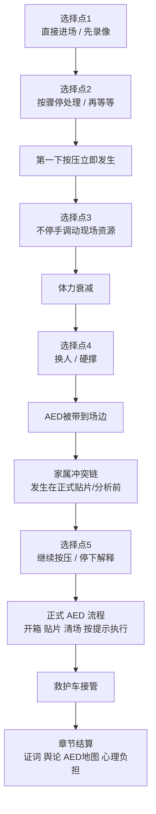

# 《生命守护者》第一章互动系统表

## 说明

本文档用于把第一章的叙事选择转成可执行的系统变量、判定规则与章节承接条件。

- 面向对象：策划、程序、关卡、交互、复盘界面设计。
- 作用范围：第一章序幕到 AED 地图结尾。
- 原则：急救专业正确性优先，叙事冲突不能反向破坏医学逻辑。

## 核心流程图

## 隐藏变量表

| 变量名 | 类型 | 来源 | 记录方式 | 主要影响 |
| --- | --- | --- | --- | --- |
| `press_start_delay` | 数值（秒） | 选择点1、选择点2 | 从倒地到第一下按压的总延误 | 结局评价、医学复盘、老人救回概率权重 |
| `false_wait_penalty` | 数值（秒） | 选择点2 选“再等等” | 固定增加约22秒 | 医学复盘、王远心理负担、林小雨反应强度 |
| `resource_activation` | 枚举 | 选择点3 | `witness` / `record` | 现场秩序、证人可信度、舆论扩散度 |
| `compression_interrupt_time` | 数值（秒） | 家属冲突、换人失误、AED准备阶段 | 累计所有按压中断 | 医学复盘、结局评价、心理负担 |
| `compression_quality` | 枚举或分数 | 节奏、深度、是否及时换人 | 建议 0-100 或 low/medium/high | 医学评分、救治可信度、复盘文本 |
| `takeover_success` | 布尔 + 分数 | 选择点4 选“让路人接替” | 是否完成无明显中断接替 | 按压质量、王远体力状态、林小雨成长表现 |
| `aed_arrival_timing` | 枚举 | 是否及时调动马志国 | `early` / `mid` / `late` | AED流程评分、现场希望感、后续复盘 |
| `aed_protocol_clean` | 布尔 | 贴片、清场、按提示执行 | 是否完成“擦干贴片区域、无人接触患者、按机器提示执行” | 急救专业评分、公益表达准确性 |
| `witness_credibility` | 数值 | 孙建国、林小雨、马志国是否被激活 | 三人分别记分后汇总 | 第二章舆论、警方/医护时间线可信度 |
| `public_spread` | 数值 | 选择点3 选录像、直播后续 | 记录全景 vs 直播扩散 | 第二章网络压力、传播失真程度 |
| `family_trust` | 数值 | 家属冲突时是否有人作证、是否持续按压 | 初始低，后续动态修正 | 冲突强度、赵雪梅后续态度、和解可能性 |
| `wangyuan_burden` | 数值 | 延误、中断、是否退缩、是否得到旁证 | 累积型 | 第一章尾声文本、第二章心理状态、个人线 |

## 变量来源细化

| 节点 | 行为 | 变量变化 |
| --- | --- | --- |
| 选择点1 | 直接进场 | `press_start_delay` 较低 |
| 选择点1 | 先录像 | `press_start_delay` 增加，`public_spread` 起始值增加 |
| 选择点2 | 按骤停处理 | 立即进入 `cpr_first_push` |
| 选择点2 | 再等等 | `false_wait_penalty += 22`，`press_start_delay` 同步增加 |
| 选择点3 | 点名作证 | `resource_activation = witness`，`witness_credibility` 上升 |
| 选择点3 | 让人录像 | `resource_activation = record`，`public_spread` 上升 |
| 选择点4 | 让路人接替 | 根据交接质量改变 `takeover_success` 与 `compression_quality` |
| 选择点4 | 自己硬撑 | `compression_quality` 更容易随疲劳下降，`wangyuan_burden` 上升 |
| 选择点5 | 继续按压 | `compression_interrupt_time` 最低，`family_trust` 依赖证人修复 |
| 选择点5 | 停下解释 | `compression_interrupt_time` 明显增加，`wangyuan_burden` 上升 |
| AED流程 | 擦干贴片区域、清场、按提示执行 | `aed_protocol_clean = true` |
| AED流程 | 玩家误操作或长时间迟疑 | `aed_protocol_clean = false`，`compression_interrupt_time` 增加 |

## 建议判定规则

1. 第一按压优先级高于现场组织。  
`cpr_first_push` 必须在选择点2后立即发生；选择点3不再增加第一下按压延误。

2. 家属冲突链发生在正式 AED 机器流程前。  
此时 AED 最多只被带到场边，不能已经进入贴片、分析或按钮执行。

3. AED 不由玩家判断心律。  
玩家只负责：
   - 擦干贴片区域
   - 确认无人接触患者
   - 按机器提示执行

4. CPR 频率统一按每分钟 100-120 次。  
若做轻操作，节拍判定区间应覆盖标准下限与上限，不建议只锁死 100。

## 章节结算建议

| 结算维度 | 主要读取变量 |
| --- | --- |
| 医学复盘 | `press_start_delay`、`compression_interrupt_time`、`compression_quality`、`aed_protocol_clean` |
| 现场协作 | `resource_activation`、`takeover_success`、`witness_credibility` |
| 舆论后果 | `public_spread`、`witness_credibility` |
| 家属关系 | `family_trust` |
| 王远心理余波 | `wangyuan_burden` |

## 第二章承接建议

| 第二章内容 | 第一章前置变量 |
| --- | --- |
| 网络舆论压力 | `public_spread`、`witness_credibility` |
| 医护/警方时间线认可度 | `witness_credibility`、`aed_protocol_clean` |
| 赵雪梅态度 | `family_trust`、`compression_interrupt_time` |
| 王远心理线 | `wangyuan_burden` |
| 社区培训 / AED系统议题 | `aed_arrival_timing`、`public_spread`、`医学复盘结果` |

## 实装备注

- 本表是系统层文档，不直接上屏。
- 变量命名建议在程序层保留英文蛇形命名，方便后续章节复用。
- 如果后面要做正式 GDD，可把本表直接并入“Core Systems / Chapter State / End-of-Chapter Evaluation”三节。
